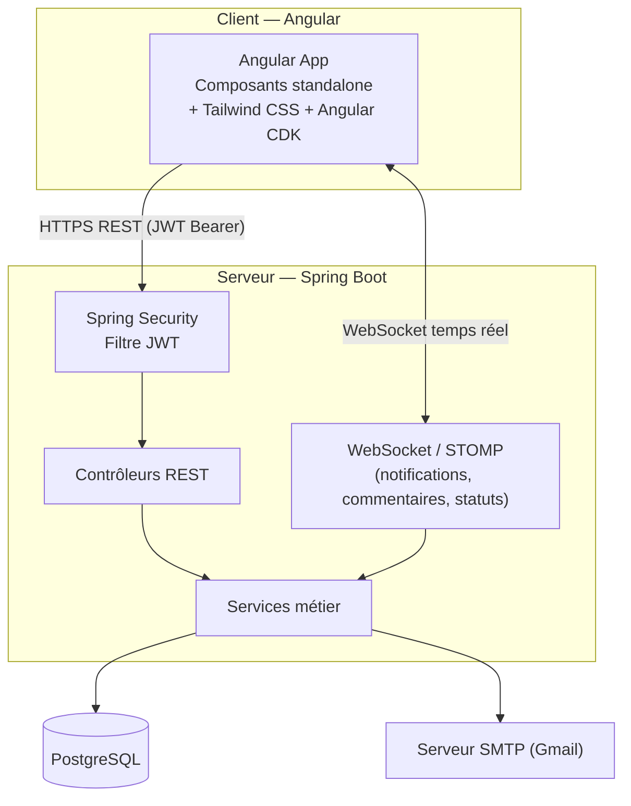
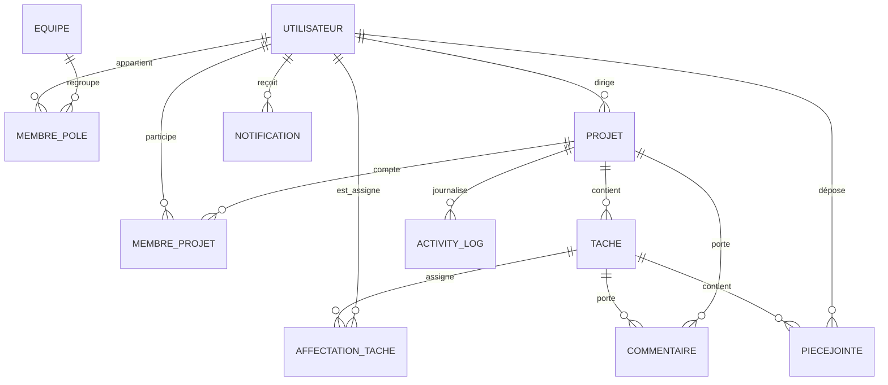

# CollabHub


**CollabHub** est une plateforme web de gestion collaborative de projets, développée dans le cadre d'un stage. Elle permet à une organisation de structurer ses équipes en pôles, de piloter des projets et des tâches en mode Kanban, et de collaborer en temps réel (commentaires, mentions, notifications, pièces jointes).
## Sommaire

- [Aperçu](#aperçu)
- [Fonctionnalités](#fonctionnalités)
- [Modèle organisationnel & rôles](#modèle-organisationnel--rôles)
- [Architecture](#architecture)
- [Modèle de données (simplifié)](#modèle-de-données-simplifié)
- [Stack technique](#stack-technique)
- [Installation](#installation)
- [Limitations connues](#limitations-connues)
- [Structure du dépôt](#structure-du-dépôt)

---
## Aperçu

CollabHub couvre le cycle de vie complet d'un projet :

- Création et suivi de **projets** et de **tâches** (vue Kanban avec glisser-déposer)
- Organisation matricielle en **pôles** (équipes fixes) et en **équipes projet** (dynamiques)
- **Collaboration en temps réel** : commentaires filetés avec mentions, notifications instantanées, indicateur de statut d'activité (disponible / en réunion / en pause / hors ligne)
- **Pièces jointes** par tâche
- **Tableau de bord** avec statistiques (avancement, répartition par statut, activité mensuelle)
- Gestion sécurisée des comptes (création par un administrateur, mot de passe temporaire envoyé par email, réinitialisation de mot de passe)

---
## Fonctionnalités

### Gestion de projets & tâches
- Création, modification, suivi d'avancement des projets (statut, priorité, échéance)
- Tâches organisées en Kanban (À faire / En cours / Bloquée / Terminée) avec glisser-déposer
- Affectation de plusieurs collaborateurs par tâche
- Historique d'activité par projet (création, modification, ajout/retrait de membres)
- Alertes automatiques d'échéance (approchante / dépassée) pour les tâches et les projets

### Organisation & équipes
- **Pôles** : structure organisationnelle fixe (ex. Pôle Dev, Pôle QA), un utilisateur pouvant appartenir à plusieurs pôles
- **Équipe projet** : composition dynamique et indépendante des pôles, propre à chaque projet
- Ajout / retrait de membres avec traçabilité (soft delete, historique conservé)

### Collaboration
- Espace de discussion par projet et par tâche : commentaires filetés (réponses imbriquées), mentions (`@utilisateur` ou `@tous`)
- Notifications en temps réel (WebSocket/STOMP) et notifications persistées, avec toasts et centre de notifications
- Statut de présence en direct (disponible, en réunion, en pause, hors ligne), mis à jour automatiquement à la connexion/déconnexion

### Fichiers
- Upload, téléchargement, renommage et suppression de pièces jointes par tâche
- Contrôle d'accès basé sur le rôle et l'affectation à la tâche

### Comptes & sécurité
- Création de compte réservée à l'administrateur : mot de passe temporaire généré aléatoirement et envoyé par email
- Authentification par JWT, autorisations fines par endpoint (`@PreAuthorize`)
- Suspension de compte : blocage HTTP immédiat et déconnexion forcée des sessions WebSocket actives
- Réinitialisation de mot de passe par email (lien à usage unique, expirant)

### Tableau de bord
- Statistiques globales (membres actifs, projets, tâches, taux de complétion)
- Répartition des projets/tâches par statut, activité mensuelle (créées vs terminées)

  ---

## Modèle organisationnel & rôles

CollabHub distingue trois rôles globaux :

| Rôle | Description | Permissions clés |
|---|---|---|
| **ADMINISTRATEUR** | Supervision globale de la plateforme | Crée les comptes, gère les pôles, voit tous les projets/utilisateurs, peut suspendre un compte |
| **CHEF_PROJET** | Pilote un ou plusieurs projets | Crée/modifie ses projets et leurs tâches, gère l'équipe du projet, voit les membres de ses projets |
| **COLLABORATEUR** | Contribue aux tâches qui lui sont assignées | Met à jour l'avancement de ses tâches, commente, ne peut **pas** consulter le détail d'un autre collaborateur (interaction limitée aux commentaires) |

La structure est **matricielle** :
- un **pôle** (`Equipe`) est un regroupement organisationnel fixe, avec une relation N-N vers les utilisateurs (`membre_pole`) ;
- un **projet** a sa propre équipe, indépendante des pôles, avec une relation N-N dynamique (`membre_projet`).

---

## Architecture



**Points clés d'architecture :**
- **Backend** : Spring Boot / Gradle, couches Contrôleur → Service → Repository (JPA/Hibernate), DTO dédiés pour toutes les entrées/sorties.
- **Sécurité** : authentification JWT (stateless), autorisations par rôle (`@PreAuthorize`), protection IDOR sur les endpoints sensibles, autorisation explicite au niveau des souscriptions WebSocket (`SUBSCRIBE`), pas seulement à la connexion.
- **Temps réel** : STOMP sur WebSocket natif pour les commentaires, les notifications et les statuts de présence, avec réabonnement automatique après reconnexion.
- **Frontend** : composants Angular standalone
- **Suppression logique (soft delete)** : toutes les entités, y compris les tables de jonction, utilisent une colonne `date_suppression` plutôt qu'une suppression physique, pour conserver la traçabilité historique.

---

## Modèle de données (simplifié)



Toutes les entités possèdent `date_creation` et `date_suppression` (soft delete), omises ici pour la lisibilité.

---

## Stack technique

| Domaine | Technologies |
|---|---|
| Backend | Spring Boot, Spring Security, Spring Data JPA / Hibernate, JJWT, Lombok, Gradle |
| Frontend | Angular (standalone components), Tailwind CSS, Angular CDK (drag & drop), RxJS, `@stomp/stompjs` |
| Base de données | PostgreSQL |
| Temps réel | WebSocket natif + protocole STOMP |
| Emails | Gmail SMTP (création de compte, réinitialisation de mot de passe) |
| Outils | IntelliJ IDEA, GitHub |

---

## Installation

### Prérequis
- Java 17+ et Gradle
- Node.js et Angular CLI
- PostgreSQL

### Variables d'environnement (backend)

Le backend attend les variables suivantes (à définir dans la configuration d'exécution ou les variables système) :

| Variable | Description |
|---|---|
| `SPRING_DATASOURCE_URL` | URL de connexion PostgreSQL |
| `SPRING_DATASOURCE_USERNAME` / `SPRING_DATASOURCE_PASSWORD` | Identifiants de la base |
| `JWT_SECRET` | Clé secrète de signature des JWT |
| `JWT_EXPIRATION` | Durée de validité du token (ms) |
| `SPRING_MAIL_USERNAME` / `SPRING_MAIL_PASSWORD` | Identifiants SMTP (Gmail) |
| `APP_UPLOAD_DIR` / `APP_UPLOAD_DIR_PROFILS` | Répertoires de stockage des fichiers et photos de profil |


### Lancer le backend

```bash
cd Backend
./gradlew bootRun
```

Le serveur démarre par défaut sur `http://localhost:8080`.

### Lancer le frontend

```bash
cd Frontend
npm install
ng serve
```

L'application est accessible sur `http://localhost:4200`.

---

## Limitations connues

Ces points sont assumés et documentés en connaissance de cause :

- **Pièces jointes** : aucune restriction de type de fichier côté serveur (choix assumé, le périmètre incluant potentiellement des fichiers exécutables dans un contexte professionnel) ; la limite de taille n'est vérifiée que côté client.
- **Renommage de pièce jointe** : ne permet de changer que le nom, pas l'extension ni le format du fichier.

---

## Structure du dépôt

```
CollabHub/
├── Backend/     # API Spring Boot (Gradle)
└── Frontend/    # Application Angular
```

---

*Projet développé dans le cadre d'un stage, sous encadrement académique.*
